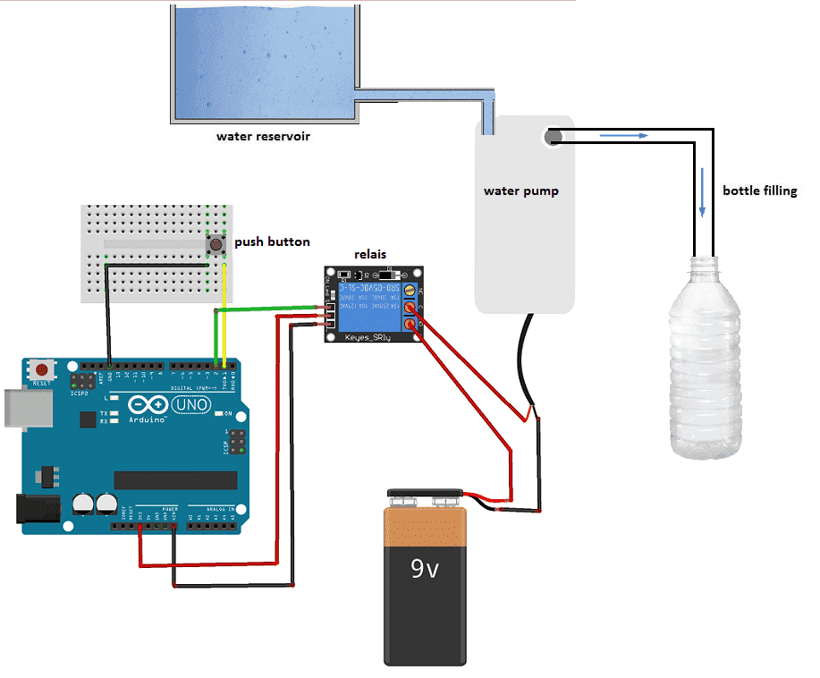
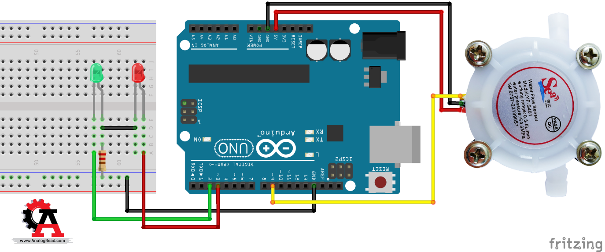

# Hemodialysis

## Description
This Arduino sketch implements a system for controlling pumps and monitoring various sensors. The system includes features such as controlling pump relays, monitoring temperature, detecting air in the fluid line, and measuring flow rates using sensors.

## Components
- Arduino board
- 2 Water pump
- DHT11 temperature and humidity sensor
- Flow sensors (YF-S201)
- Relay modules
- Infrared (IR) sensor
- Buzzer
- LEDs
- Connecting wires

## Setup
1. Connect the components according to the wiring diagram.
2. Upload the provided Arduino sketch to the board.
3. Power on the system and monitor the sensor readings on the serial monitor.

## Features
- **Pump Control:** Two relay modules control the operation of pumps. The pumps are turned on and off based on specified time intervals.
- **Temperature Monitoring:** The DHT11 sensor measures the temperature, and if it falls below a certain threshold, an alarm buzzer is activated.
- **Flow Rate Measurement:** Two flow sensors measure the flow rates of liquids passing through them.
- **Air Detection:** An infrared (IR) sensor detects air in the fluid line and triggers an LED indicator.
- **Real-time Monitoring:** Sensor readings are continuously updated and displayed on the serial monitor.

## Usage
1. The system continuously monitors temperature, flow rates, and air presence in the fluid line.
2. Pump operation is controlled based on specified time intervals.
3. If the temperature falls below a threshold, the buzzer is activated to alert the user.
4. The IR sensor detects air in the fluid line and triggers an LED indicator.

## Circuit Diagram

## Dependencies
- Arduino IDE
- DHT library
- SoftwareSerial library (if required)

